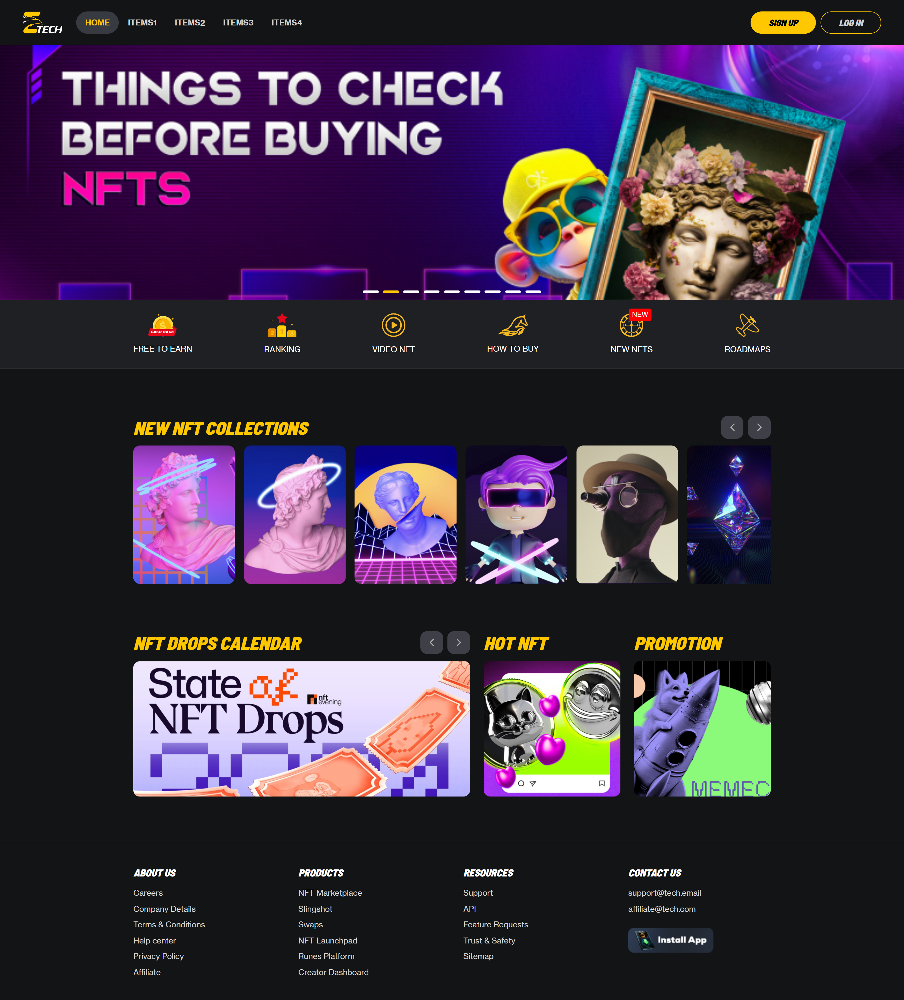
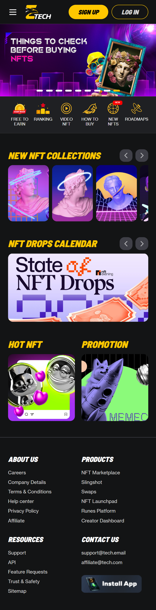
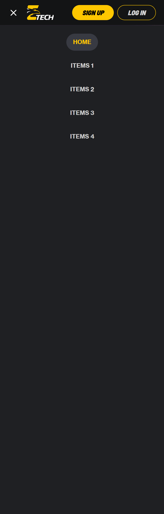

# React + Vite

This project is built using **React** and **Vite**.

## 🚀 How to Run the Website

### 1. Install dependencies

```bash
npm install
```

### 2. Run the development server

```bash
npm run dev
```

### 3. Build for production

```bash
npm run build
```

---

## ✅ Output

Link Product: [https://nevel-test-tau.vercel.app](https://nevel-test-tau.vercel.app)

---

## 📸 Screenshots

### 1. Desktop Screen


### 2. Mobile Screen


### 3. Menu in Mobile Screen


Feel free to contribute or raise issues if needed.

